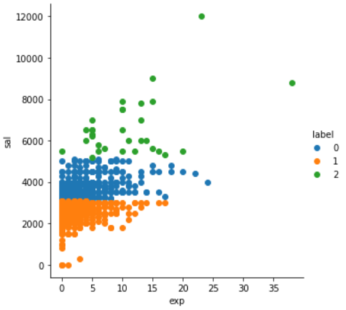
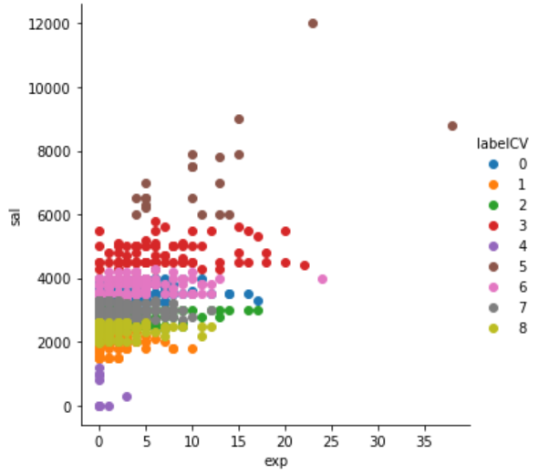

# Project: Job Applicants Clustering

# Description
Using simple unsupervised machine learning algorithm (K-Means) to cluster 2000+ JobStreet job applicants for a Keysight Graduate Engineer Position.

# Results
## Scatter plots of Salary (RM) vs Experience (Years)

# Credits
- [Ridhwan Razali for manually extracting data](https://github.com/ridhwanrazaliwork)
- [Markdown badges source 1](https://github.com/Ileriayo/markdown-badges)
- [Markdown badges source 2](https://github.com/alexandresanlim/Badges4-README.md-Profile)